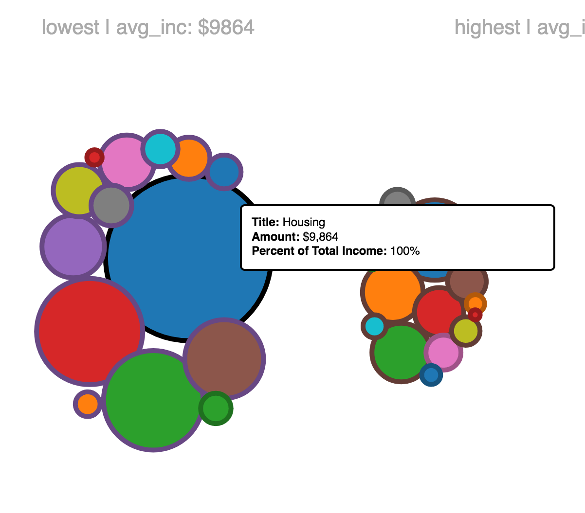

# Consumer Expenditure Visualized
This is a d3 visualization project using the Consumer Expenditure survey data to try to visualize the average American's spending. This data is provided through a survey and divided by many subcategories including race, gender, and age. We decided to focus on the difference in spending habits between those in the lowest 10% income level, those in the 10% highest, and those in the middle. 

Essentially, our goal was to easily and effective communicate how the rich spend their money vs the poor.

## Inspirations and Visualization Choice
Starting out, we knew we wanted to use d3 force and simulation to help visualize this as we thought the physically moving aspect of the data would provide an appealing visual aspect as well as help show the transformation between groups.

We also wanted to prioritize interactivity to provide users a level of control over the visualization and granularity. Drawing from inspiration available on other visualizations, we focused mainly on these two visualizations:
* http://ustimeuse.github.io/oneday.html
* https://github.com/vlandham/bubble_chart_v4

Both of these visualizations utilize d3's force module and visualize some data set regarding finance or time, so heavily quantitative data.

## Visualization Methods
The methods of visualization we chose are effective because they allow the user to comparitatively view the spending by demographic per category. The two most important variables to us are the spending in each category and the income level. So we chose to give user's the ability to control the color scheming based on either category or income level. That way they can easily compare the spending of some specific category (Healthcare) vs some particular income level (lowest 10%).

## The Story
Our visualization brought out some really important points we did not realize from the data at first glance. One example of this is the Housing spending in the lowest income level. When we drew the bubbles for this category, we saw that this bubble was the biggest bubble, which we thought must have been a bug because the total average income should be the biggest number for each subject. So it didn't make sense that the average lowest salary after taxes was $6376 and the housing cost was $9864. The only way we can justify that is that the most poor Americans are spending more on their housing than they even have, which would make sense when you consider roommates and credit loans which are taking prevelance. 

Another important point our visualization helped illuminate was the variation in spending between categories by income level. For example, rich americans are spending almost 20% of their income on personal insurance and pension, more than double the other two groups percentage. Comparitavely, they also spend the least on healthcare (about 5%) while the average spends 10% of their salary and the lowest spends almost 15%.

The scaling for the bubble's radii helps users easily compare spending per total as opposed to total spending. 

## Future Goals
If we had more time, here are some changes we'd like to make to the project:
* More fluid animations on the transformation when the bubbles move.
* Collision protection to prevent bubble overlap.
* Filtering of categories to allow users to only show certain categories, possibly with a radio input list form thingy.
* Inclusion of other demographics for comparison.
* Further breakdown of spending within category using more of the data available from the dataset.
